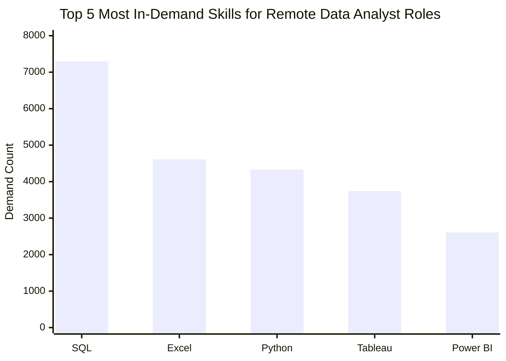
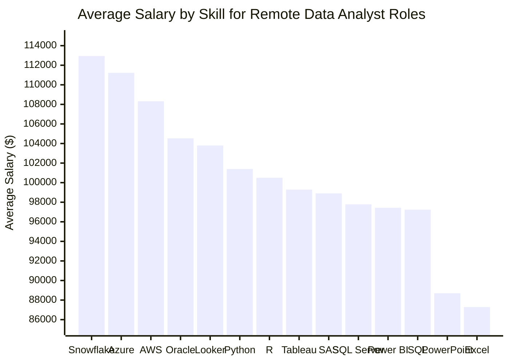
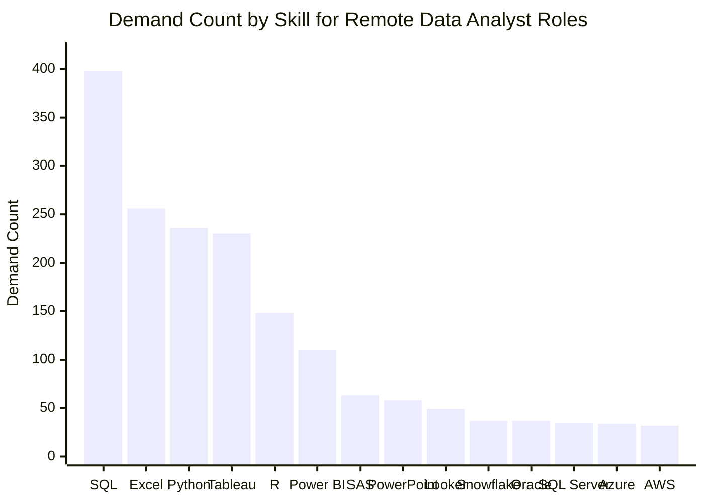

# Data Analyst Job Market Analysis

## Project Overview

This project analyzes Data Analyst job postings to understand which skills are most valuable in the job market. The analysis focuses on remote Data Analyst roles and explores three main areas:

1. The highest-paying remote Data Analyst jobs
2. The most in-demand skills for Data Analyst roles
3. The most optimal skills to learn based on both demand and salary

The goal of this project is to identify which technical skills provide the best career value for aspiring Data Analysts.

---

## Business Questions

This project answers the following questions:

1. What are the top-paying remote Data Analyst jobs?
2. What skills are required for the top-paying Data Analyst jobs?
3. What are the most in-demand skills for remote Data Analyst roles?
4. Which skills are associated with the highest average salaries?
5. Which skills are both high-demand and high-paying?

---

## Tools Used

* **SQL**: Data querying, filtering, joins, aggregation, and ranking
* **PostgreSQL**: Relational database management
* **VS Code**: SQL writing and project organization
* **Excel / Power BI**: Recommended for visualization and dashboarding
* **GitHub**: Project documentation and portfolio presentation

---

## Dataset

The dataset contains job postings with information such as:

* Job title
* Company name
* Job location
* Remote/work-from-home status
* Salary information
* Required skills
* Job posting date

The main tables used were:

| Table               | Description                                                                   |
| ------------------- | ----------------------------------------------------------------------------- |
| `job_postings_fact` | Main job posting table containing role, salary, location, and posting details |
| `company_dim`       | Company information linked to job postings                                    |
| `skills_dim`        | List of skills and skill IDs                                                  |
| `skills_job_dim`    | Bridge table connecting jobs with required skills                             |

---

## Analysis 1: Top-Paying Remote Data Analyst Jobs

### Objective

Identify the top 10 highest-paying remote Data Analyst jobs with available salary information.

### SQL Query

```sql
SELECT	
    job_id,
    job_title,
    job_location,
    job_schedule_type,
    salary_year_avg,
    job_posted_date,
    name AS company_name
FROM
    job_postings_fact
LEFT JOIN company_dim ON job_postings_fact.company_id = company_dim.company_id
WHERE
    job_title_short = 'Data Analyst' AND
    job_location = 'Anywhere' AND
    salary_year_avg IS NOT NULL
ORDER BY
    salary_year_avg DESC
LIMIT 10;
```

### Result Summary

* Top salaries ranged from approximately **$184K to $650K**.
* Many of the highest-paying roles were not standard entry-level analyst positions.
* Several roles included senior-level titles such as **Director of Analytics** and **Principal Data Analyst**.
* Top-paying companies included organizations such as **Meta**, **AT&T**, and **SmartAsset**.

### Key Insight

High-paying Data Analyst roles are strongly connected to seniority, specialization, and strategic responsibility. The highest salaries are usually not attached to basic reporting roles, but to roles involving leadership, advanced analytics, or business ownership.

### Business Takeaway

Candidates aiming for higher-paying Data Analyst roles should focus on developing advanced technical skills, business decision-making ability, and domain specialization.

---

## Analysis 2: Skills Required for the Top-Paying Jobs

### Objective

Identify which skills are required for the top 10 highest-paying remote Data Analyst roles.

### SQL Query

```sql
WITH top_paying_jobs AS (
    SELECT	
        job_id,
        job_title,
        salary_year_avg,
        name AS company_name
    FROM
        job_postings_fact
    LEFT JOIN company_dim ON job_postings_fact.company_id = company_dim.company_id
    WHERE
        job_title_short = 'Data Analyst' AND
        job_location = 'Anywhere' AND
        salary_year_avg IS NOT NULL
    ORDER BY
        salary_year_avg DESC
    LIMIT 10
)

SELECT
    top_paying_jobs.*,
    skills
FROM top_paying_jobs
INNER JOIN skills_job_dim ON top_paying_jobs.job_id = skills_job_dim.job_id
INNER JOIN skills_dim ON skills_job_dim.skill_id = skills_dim.skill_id
ORDER BY
    salary_year_avg DESC;
```

### Result Summary

The top-paying Data Analyst jobs commonly required a mix of:

* SQL
* Python
* Tableau
* Power BI
* Excel
* Cloud tools such as AWS and Azure
* Data engineering tools such as Snowflake, Databricks, and PySpark

### Key Insight

Top-paying Data Analyst roles are not limited to basic reporting skills. They often combine core analytics skills like SQL and Python with visualization tools, cloud platforms, and data infrastructure knowledge.

### Business Takeaway

To compete for premium Data Analyst roles, candidates should develop skills beyond SQL and Excel. Cloud platforms, BI tools, and Python-based analytics can help increase competitiveness for higher-paying positions.

---

## Analysis 3: Most In-Demand Skills for Remote Data Analyst Roles

### Objective

Identify the top 5 most in-demand skills for remote Data Analyst roles.

### SQL Query

```sql
SELECT
    skills,
    COUNT(skills_job_dim.job_id) AS demand_count
FROM job_postings_fact
INNER JOIN skills_job_dim ON job_postings_fact.job_id = skills_job_dim.job_id
INNER JOIN skills_dim ON skills_job_dim.skill_id = skills_dim.skill_id
WHERE
    job_title_short = 'Data Analyst'
    AND job_work_from_home = True
GROUP BY
    skills
ORDER BY
    demand_count DESC
LIMIT 5;
```

### Results

| Rank | Skill    | Demand Count |
| ---: | -------- | -----------: |
|    1 | SQL      |        7,291 |
|    2 | Excel    |        4,611 |
|    3 | Python   |        4,330 |
|    4 | Tableau  |        3,745 |
|    5 | Power BI |        2,609 |

### Graph: Top 5 Most In-Demand Skills



SQL clearly has the highest demand, followed by Excel, Python, Tableau, and Power BI. This shows that both technical querying skills and business-facing tools remain important for Data Analyst roles.

### Key Insight

SQL is the most in-demand skill by a large margin. Excel, Python, Tableau, and Power BI also appear frequently, showing that Data Analyst roles require a combination of data extraction, spreadsheet analysis, programming, and visualization skills.

### Business Takeaway

For aspiring Data Analysts, SQL should be the first priority, followed by Excel, Python, and at least one BI tool such as Tableau or Power BI.

---

## Analysis 4: Top Skills Based on Salary

### Objective

Find the skills associated with the highest average salaries for remote Data Analyst roles.

### SQL Query

```sql
SELECT
    skills,
    ROUND(AVG(salary_year_avg), 0) AS avg_salary
FROM job_postings_fact
INNER JOIN skills_job_dim ON job_postings_fact.job_id = skills_job_dim.job_id
INNER JOIN skills_dim ON skills_job_dim.skill_id = skills_dim.skill_id
WHERE
    job_title_short = 'Data Analyst'
    AND salary_year_avg IS NOT NULL
    AND job_work_from_home = True
GROUP BY
    skills
ORDER BY
    avg_salary DESC
LIMIT 25;
```

### Result Summary

The highest-paying skills were mostly associated with:

* Big data tools such as PySpark and Databricks
* Machine learning and Python ecosystem tools such as Pandas, NumPy, Jupyter, and Scikit-learn
* Cloud and infrastructure tools such as GCP, Kubernetes, and Airflow
* Data engineering and development tools such as GitLab and Jenkins

### Key Insight

The highest-paying Data Analyst skills lean toward technical, infrastructure-oriented, and data engineering-related tools. This suggests that higher compensation is associated with roles that go beyond traditional reporting and involve more complex data systems.

### Limitation

This analysis ranks skills by average salary only. Some high-paying skills may appear in very few job postings, which can make their average salary less reliable.

---

## Analysis 5: Most Optimal Skills to Learn

### Objective

Identify skills that are both high-demand and high-paying for remote Data Analyst roles.

To reduce noise from rare skills, this query filters for skills that appear in at least 30 job postings.

### SQL Query

```sql
SELECT
    skills_dim.skills,
    COUNT(skills_job_dim.job_id) AS demand_count,
    ROUND(AVG(job_postings_fact.salary_year_avg), 0) AS avg_salary
FROM job_postings_fact
INNER JOIN skills_job_dim ON job_postings_fact.job_id = skills_job_dim.job_id
INNER JOIN skills_dim ON skills_job_dim.skill_id = skills_dim.skill_id
WHERE
    job_title_short = 'Data Analyst'
    AND salary_year_avg IS NOT NULL
    AND job_work_from_home = True
GROUP BY
    skills_dim.skills
HAVING
    COUNT(skills_job_dim.job_id) >= 30
ORDER BY
    avg_salary DESC,
    demand_count DESC
LIMIT 15;
```

### Results

| Rank | Skill      | Demand Count | Average Salary |
| ---: | ---------- | -----------: | -------------: |
|    1 | Snowflake  |           37 |       $112,948 |
|    2 | Azure      |           34 |       $111,225 |
|    3 | AWS        |           32 |       $108,317 |
|    4 | Oracle     |           37 |       $104,534 |
|    5 | Looker     |           49 |       $103,795 |
|    6 | Python     |          236 |       $101,397 |
|    7 | R          |          148 |       $100,499 |
|    8 | Tableau    |          230 |        $99,288 |
|    9 | SAS        |           63 |        $98,902 |
|   10 | SQL Server |           35 |        $97,786 |
|   11 | Power BI   |          110 |        $97,431 |
|   12 | SQL        |          398 |        $97,237 |
|   13 | PowerPoint |           58 |        $88,701 |
|   14 | Excel      |          256 |        $87,288 |

> Note: SAS appeared twice in the raw results because it had two different `skill_id` values. Grouping by `skills` instead of `skill_id` removes this duplicate.

### Graph 1: Average Salary by Skill



Cloud and data platform skills such as Snowflake, Azure, and AWS are associated with the highest average salaries.

### Graph 2: Demand Count by Skill



SQL has the highest demand, followed by Excel, Python, and Tableau. This confirms that SQL is a foundational requirement for Data Analyst roles.

### Graph 3: Skill Value Matrix

The table below works as a simplified skill value matrix by comparing demand and salary together.

| Skill Category                         | Meaning                           | Skills From This Analysis             |
| -------------------------------------- | --------------------------------- | ------------------------------------- |
| High demand + strong salary            | Best overall skills to prioritize | SQL, Python, Tableau, Power BI        |
| Lower demand + higher salary           | Specialized salary premium skills | Snowflake, Azure, AWS, Oracle, Looker |
| High demand + lower salary premium     | Foundational skills               | SQL, Excel                            |
| Lower demand + useful supporting value | Helpful but more role-dependent   | PowerPoint, SAS, SQL Server           |

### Optional Visual: Salary vs Demand Scatter Plot

GitHub Mermaid does not reliably support scatter plots in all repositories. If this project is later visualized in Excel or Power BI, the strongest chart would be:

* X-axis: Demand count
* Y-axis: Average salary
* Point label: Skill
* Title: `Skill Value Matrix: Demand vs Salary`

This would clearly show SQL as very high-demand, while Snowflake, Azure, and AWS appear as lower-demand but higher-salary premium skills.

### Result Summary

The most optimal skills can be grouped into the following categories:

* **Cloud & Data Platforms:** Snowflake, Azure, AWS
* **Programming & Analytics:** Python, R
* **BI & Visualization:** Tableau, Power BI, Looker
* **Databases:** SQL, SQL Server, Oracle
* **Foundational Tools:** Excel, PowerPoint

### Key Insight

Cloud and data platform skills show the strongest salary premium. Snowflake, Azure, and AWS have lower demand than SQL, Python, Excel, and Tableau, but they are associated with the highest average salaries in the final skill set.

### Additional Insight

SQL has the highest demand in the dataset, but its average salary is lower than specialized cloud and platform tools. This suggests that SQL is a foundational requirement for Data Analyst roles rather than a standalone salary differentiator.

### Business Takeaway

To maximize both job opportunities and salary potential, candidates should:

* Master SQL and Excel as baseline skills
* Build strong analytical capability with Python
* Learn at least one BI tool such as Tableau or Power BI
* Add cloud/data platform knowledge such as Snowflake, Azure, or AWS

### Limitation

This analysis focuses only on remote Data Analyst roles with available salary data. The minimum demand count threshold reduces noise from rare skills, but it may exclude some niche, high-paying skills that appear in fewer job postings.

---

## Final Recommendations

Based on the analysis, the strongest skill roadmap for aspiring Data Analysts is:

1. **SQL** — highest demand and essential for almost all data roles
2. **Excel** — still widely used in business reporting and analysis
3. **Python** — strong demand and useful for advanced analysis
4. **Tableau or Power BI** — important for dashboarding and business communication
5. **Cloud/Data Platforms** — Snowflake, Azure, or AWS can help differentiate candidates and improve salary potential

---

## Key Learnings

This project helped practice the following SQL concepts:

* Filtering with `WHERE`
* Joining multiple tables
* Using `LEFT JOIN` and `INNER JOIN`
* Aggregating with `COUNT()` and `AVG()`
* Grouping with `GROUP BY`
* Filtering aggregated results with `HAVING`
* Sorting with `ORDER BY`
* Using Common Table Expressions (CTEs)
* Interpreting results from a business perspective

---

## Project Conclusion

The analysis shows that Data Analyst roles require both foundational and specialized skills. SQL, Excel, Python, Tableau, and Power BI remain highly important, while cloud and data platform tools such as Snowflake, Azure, and AWS are associated with higher salary potential.

The most valuable career strategy is not to focus on one tool only, but to build a balanced skill set: strong foundations in SQL and Excel, analytical depth with Python, communication through BI tools, and differentiation through cloud/data platform knowledge.
